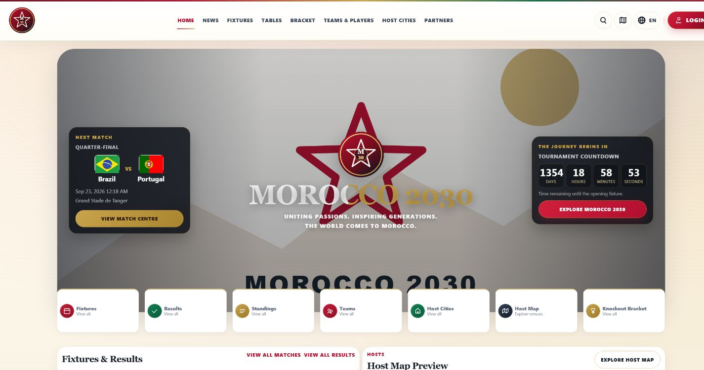

# Morocco2030

## Full-Stack Tournament Management & Public Portal

[](https://github.com/aymanbouanouj/morocco2030/actions/workflows/ci.yml)
[](https://github.com/aymanbouanouj/morocco2030/releases/latest)
[](https://doi.org/10.5281/zenodo.22907985)
[](LICENSE)
[](https://laravel.com/)
[](https://www.php.net/)
[](#testing)

Morocco2030 is a Laravel-based platform for tournament information, editorial workflows, multilingual content, media management, and competition operations. It combines a public football portal with a role-based back office and an optional external-data integration.

**Laravel 12 | Full stack | Tournament operations | RBAC | Multilingual | 584 automated tests | API integration**
Original creator and maintainer: **Ayman Bounaouj**



> Morocco2030 is an independent academic and software engineering project. It is not an official FIFA or tournament-organizer platform.

## Original Project Demonstration

[](https://www.youtube.com/watch?v=8woZLL5p7VA)

**Watch the full 11-minute demonstration:**<br>
[Morocco2030 — Original / Presented Build](https://www.youtube.com/watch?v=8woZLL5p7VA)

> **Demo scope:** This video presents the **Original / Presented Build** of Morocco2030 — the local version developed and used during the project development and academic presentation.
>
> The source code published in this repository is the **Public Repository Edition**, prepared for safe public distribution. Sensitive runtime data was excluded, security and privacy protections were strengthened, and some visual assets, media fallbacks and data-persistence behavior were adjusted or replaced with publication-safe alternatives.
>
> As a result, some visual details shown in the video may differ from the public repository. The core architecture, tournament workflows, RBAC system, multilingual functionality, administration modules, testing strategy and overall software engineering design remain representative of the original project.

### Original / Presented Build

- Full local project used during development and academic presentation.
- Includes the original visual design and local media assets.
- Documented in the project demonstration video above.

### Public Repository Edition

- Public source code available in this repository.
- Sanitized for safe public distribution.
- Security and privacy hardened.
- Some visual and media assets replaced with publication-safe alternatives.
- Suitable for inspection, learning, experimentation, modification and contribution.

Developers are welcome to study the architecture, experiment with the application, create alternative interface designs, and contribute improvements under the repository license.

## Project overview

The application models the public and operational sides of a football tournament in one Laravel codebase. Public visitors can explore fixtures, results, standings, knockout rounds, teams, players, venues, partners, news, and multilingual content. Authorized staff use an administration area for competition, editorial, media, translation, access-control, and audit workflows.

## Key features

### Public portal

- Responsive home, news, matches, results, standings, knockout, teams, players, cities, stadiums, partners, map, search, and account pages.
- Published-content and tournament-dataset scoping so drafts and unrelated data do not leak publicly.
- Accessible navigation foundations, keyboard focus states, labels, semantic controls, reduced-motion support, and local asset fallbacks.

### Administration and RBAC

- Staff dashboard with modules exposed through middleware, gates, policies, and granular permissions.
- Roles for super/platform administration, editorial work, match and team operations, venues, sponsors, media, translation, analytics, and support.
- Strict separation between public audience accounts and staff accounts.
- Audited administrative actions with sensitive-field redaction.

### Tournament management

- Fixtures, scores, match status, events, lineups, statistics, groups, qualification rules, standings recalculation, and knockout progression.
- Public matches, results, tables, and a centered two-sided knockout bracket.
- Team, player, coach, city, stadium, and map views backed by relational models.

### Editorial and media

- News categories and draft/review/approval/publish/archive workflow.
- Media upload, metadata, attachment, archive/restore, and publication-readiness views.
- Rights-safe placeholders when redistributable media is unavailable.

### Translation and i18n

- Database-backed languages, interface translations, translatable model fields, locale switching, and RTL-aware rendering.
- Validated same-origin language return flow to prevent unsafe redirects.

### football-data.org integration

- Optional preview, import, dry-run, reconciliation, squad, team, match, and structure workflows.
- Provider token redaction, rate-limit-aware error handling, provenance metadata, and deterministic reconciliation.
- Automated tests block stray HTTP and use faked provider responses. No API data or credentials are bundled.

## Architecture

Morocco2030 is a Laravel monolith using route groups, middleware, form requests, controllers, policies, services/support classes, Eloquent models, relational storage, and Blade views. Vite builds the frontend entry points with Tailwind CSS 4.

```text
Browser -> Routes -> Middleware -> Controller -> Service/Support -> Eloquent -> Database
                                                         |
                                                         -> Blade -> HTML
```

See [Architecture](docs/ARCHITECTURE.md) for request, RBAC, translation, media, external-data, and test flows.

## Technology stack

| Area | Technology |
|---|---|
| Backend | PHP 8.2+, Laravel 12.69.2 |
| Frontend | Blade, Vite 7.3.6, Tailwind CSS 4.3.3, Axios |
| Data | MySQL/MariaDB for application use; SQLite in memory for tests |
| Build | Composer 2, npm lockfile, Vite |
| Testing | PHPUnit 11.5, Laravel HTTP testing, faked external HTTP |

## Security

- CSRF protection on state-changing web routes.
- Authentication, account-type separation, admin middleware, policies, and permission checks.
- Escaped Blade rendering by default and safe action-slot rendering.
- Password hashing, audit redaction, pseudonymized analytics, and minimized stored request data.
- Sanitized public Git lineage and mandatory secret scanning of the worktree and reachable Git objects.

See [Security Policy](SECURITY.md). This repository does not claim formal penetration-testing or compliance certification.

## Testing

Phase 3 verification completed **584 tests and 3,817 assertions** with zero failures, errors, skips, incomplete tests, or warnings.

The default `phpunit.xml` forces:

- `APP_ENV=testing` and a synthetic testing key;
- SQLite `:memory:`;
- array cache, session, and mail;
- sync queue and testing filesystem;
- global `Http::preventStrayRequests()`.

Run the isolated suite:

```bash
php artisan test
```

## Installation

### Requirements

- PHP 8.2 or newer with Laravel-required extensions
- Composer 2
- Node.js 22+ and npm
- MySQL 8+ or a compatible MariaDB release for normal application use

### Install dependencies

```bash
composer install
npm ci
```

### Environment setup

```bash
cp .env.example .env
php artisan key:generate
```

Set local database and mail values in `.env`. Never reuse production credentials, publish `.env`, or commit provider tokens. For production use `APP_ENV=production`, `APP_DEBUG=false`, HTTPS, secure cookies, and unique service credentials.

### Database and migrations

Create an empty local database, configure it in `.env`, then run:

```bash
php artisan migrate
```

Base reference data can be installed explicitly for a new local environment:

```bash
php artisan db:seed
```

Review seeders before use. Never run destructive migration or seeding commands against an existing environment without a backup and explicit approval.

### Frontend build

```bash
npm run build
```

For local frontend development:

```bash
npm run dev
```

### Run locally

```bash
php artisan serve
```

Open the URL printed by Artisan. Administrative access must be created through an approved local setup process; no credentials are published.

## Project structure

```text
app/                 Controllers, middleware, requests, models, policies, services
bootstrap/           Laravel application bootstrap
config/              Framework and integration configuration
database/            Migrations, factories, and explicit local seeders
docs/                Architecture, provenance, screenshots, technical knowledge
public/              Front controller and rights-reviewed public assets
resources/           Blade views, CSS, and JavaScript source
routes/              Public, account, authentication, and admin routes
tests/               Isolated unit and feature tests
```

## Screenshots

All screenshots use a local synthetic SQLite dataset and publication-safe `.test` identities.

| Public portal | Competition |
|---|---|
| [Home](docs/screenshots/01-home.png) | [Matches](docs/screenshots/02-matches.png) |
| [Standings](docs/screenshots/03-standings.png) | [Knockout](docs/screenshots/04-knockout.png) |
| [Teams](docs/screenshots/05-teams.png) | [Stadium map](docs/screenshots/06-stadiums-map.png) |

| Administration | Workflow |
|---|---|
| [Dashboard](docs/screenshots/07-admin-dashboard.png) | [Editorial workflow](docs/screenshots/08-editorial-workflow.png) |
| [Media manager](docs/screenshots/09-media-manager.png) | [Translations](docs/screenshots/10-translations.png) |

## Academic context

Morocco2030 demonstrates full-stack Laravel engineering across public information architecture, operational workflows, relational data design, RBAC, testing, integration boundaries, security hardening, and publication governance. It is presented as an independent educational project rather than an official tournament service.

## Provenance

The public repository starts from a sanitized reviewed snapshot because private historical provenance contained a retired credential. The private development history and the independently preserved presented version remain confidential evidence; the public lineage does not claim to reproduce their commit hashes. See [Publication Provenance](docs/PUBLICATION_PROVENANCE.md) and [Persistent Publication Identifiers](docs/PUBLICATION_IDENTIFIERS.md).

## Author

Morocco2030 was originally created by **Ayman Bounaouj** in 2026. See [Authors](AUTHORS.md), [Copyright](COPYRIGHT), and [Citation](CITATION.cff).

## Contributing

Issues and pull requests are welcome under the process in [CONTRIBUTING.md](CONTRIBUTING.md). Contributions require a Developer Certificate of Origin sign-off and are licensed under `AGPL-3.0-only`.

## License

Copyright (C) 2026 Ayman Bounaouj and contributors. Morocco2030 is licensed under the [GNU Affero General Public License version 3 only](LICENSE), SPDX identifier `AGPL-3.0-only`. Third-party assets retain their own licenses; see [Third-Party Assets](THIRD_PARTY_ASSETS.md).

## Disclaimer

Morocco2030 is independent and is not affiliated with, endorsed by, or sponsored by FIFA, a tournament organizer, a football federation, or a commercial partner. Third-party names and marks belong to their respective owners; see [Trademark Notice](TRADEMARKS.md).
