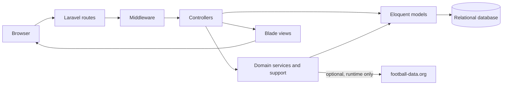
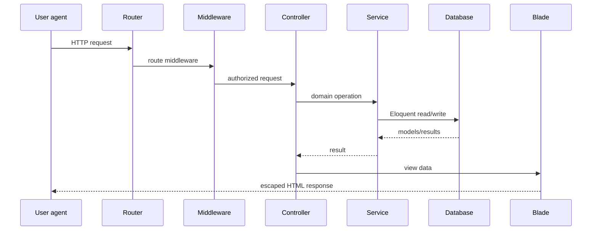
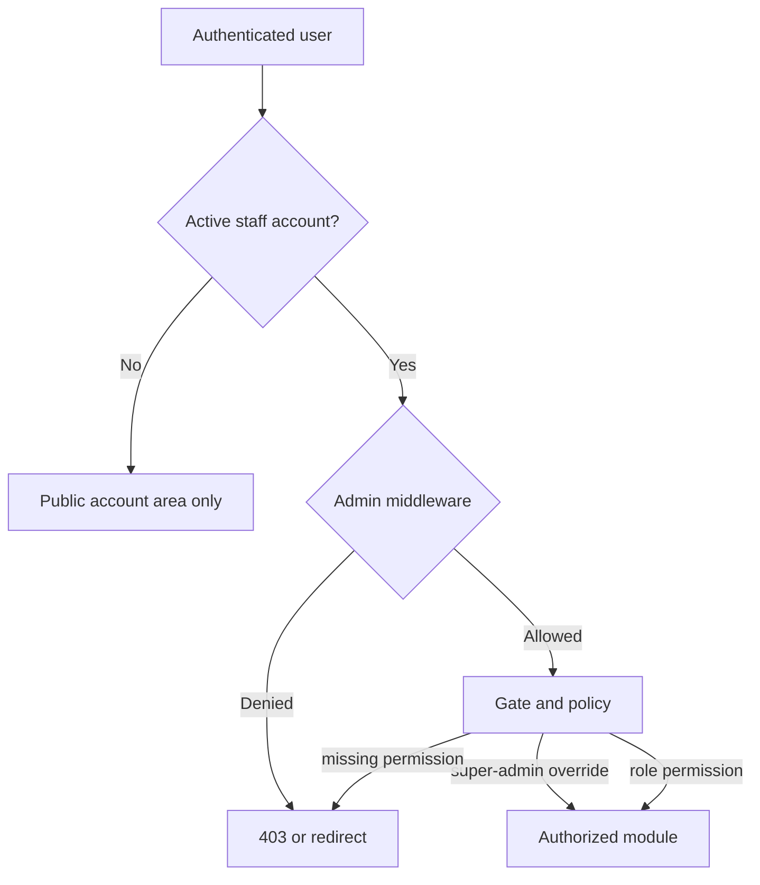

# Morocco2030 Architecture

## System shape

Morocco2030 is a Laravel 12 monolith. It serves a Blade-rendered public portal and a role-based administration area from the same application, database, domain models, and service layer. It does not use microservices.

## HTTP request flow

`public/index.php` boots Laravel through `bootstrap/app.php`. Routes are divided across public, authentication, account, and administration files. Public pages generally pass through locale and analytics middleware; administration routes use authentication plus the admin access boundary.

Controllers validate or consume form-request data, invoke focused services where domain coordination is needed, load Eloquent models, and return redirects, JSON, or Blade views. State-changing routes retain Laravel CSRF protection.

## Middleware and boundaries

- `public.locale` resolves an enabled language and controls locale-aware public rendering.
- `track.analytics` records minimized, pseudonymized visit information where configured.
- `auth` requires a valid web session.
- `admin` requires an active staff account that can access administration.
- Laravel's web middleware provides cookies, sessions, CSRF validation, bindings, and shared errors.

The language-switch controller validates return destinations to avoid unsafe external redirects. Public and staff account types remain separate in login and authorization tests.

## Controllers, requests, and services

Public controllers under `App\Http\Controllers\Site` provide read-focused pages and account flows. Administrative resource controllers coordinate CRUD and workflows under `App\Http\Controllers\Admin`. Form requests centralize validation and cross-field rules.

Reusable behavior lives in `App\Support` and `App\Services`, including:

- tournament standings and knockout progression;
- editorial workflow transitions and news media storage;
- public content/media resolution and local asset fallbacks;
- audit logging and sensitive-field redaction;
- football-data preview, import, dry-run, reconciliation, squad, and structure processing.

## Models and database

Eloquent models map to relational tables for users, roles, permissions, languages, translations, news, workflows, groups, teams, players, matches, events, lineups, statistics, standings, knockout progression, cities, stadiums, partners, media, settings, contacts, analytics, and audit logs.

Migrations are the schema source of truth. MySQL or MariaDB is intended for a normal application environment. The default automated suite uses a fresh SQLite database in memory for every isolated test lifecycle.

## Blade rendering and frontend

Blade views are separated into public and admin layouts, pages, and reusable partials. Blade escaping is used for untrusted content; explicitly rendered component/action content is constrained and tested. Local placeholders and bundled flags prevent dependence on rights-unclear remote media.

Vite compiles the CSS and JavaScript entry points. Tailwind CSS 4 is available through the Vite plugin; substantial legacy/publication styling also lives in Blade/CSS assets already organized by the application layouts.

## RBAC and policies

Roles and permissions use Eloquent many-to-many relationships. Middleware protects the administrative boundary; gates and policies enforce module and record operations. `super-admin` has a deliberate global gate override. Tests cover navigation visibility, direct routes, strict role matrices, and public/staff separation.

## Translation architecture

Languages, interface translations, and polymorphic model translations are stored relationally. `DatabaseTranslationLoader`, `PublicLocale`, and `PublicContent` connect enabled language records to Laravel translation lookup and model presentation. Locale direction supports RTL rendering. Missing or unavailable database translation data falls back safely.

## Media architecture

Media files and polymorphic media relations describe reusable uploads and their entity roles. Dedicated controllers validate MIME types, sizes, metadata, attachment targets, archive/restore behavior, and previewability. News has focused storage helpers. Public views resolve approved/local assets and fall back to neutral project-owned placeholders.

Runtime uploads are never publication artifacts and remain excluded from Git.

## football-data integration

`FootballDataClient` is the provider boundary. Import services normalize provider responses into teams, players, fixtures, scores, group metadata, and provenance fields. Dry-run and reconciliation services expose changes before mutation, while command/admin entry points apply explicit confirmation and permission checks.

The integration is optional. Credentials are environment-only, provider payloads are not bundled, and tests use `Http::fake` plus global stray-request prevention.

## Testing architecture

`phpunit.xml` forces testing mode, a synthetic key, SQLite `:memory:`, array cache/session/mail, sync queue, and a testing filesystem. `Tests\TestCase` invokes `Http::preventStrayRequests()` for every application test.

Factories and test helpers construct minimal domain state. Feature suites cover public rendering, authentication, RBAC, admin modules, editorial workflows, media, competition logic, security controls, and football-data scenarios. Unit tests cover focused data collectors and supporting behavior.

The Phase 3 release gate completed 584 tests and 3,817 assertions with no failures or errors.
